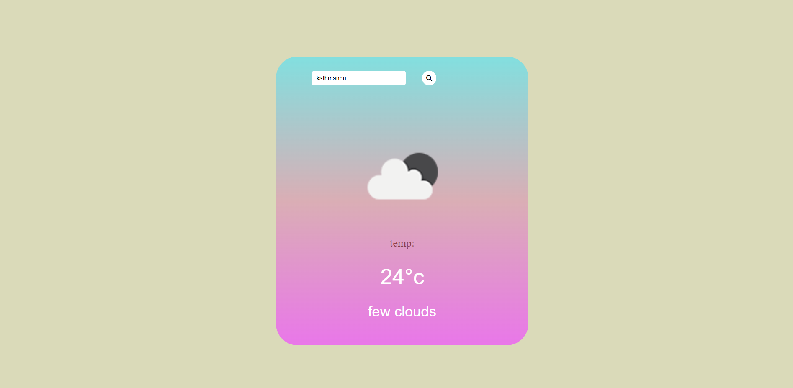

# Weather App

A simple weather application that shows current weather for any city using the OpenWeatherMap API.

## Homepage

## Output

## Features

- Search weather by city name
- Displays temperature in Celsius
- Shows weather description and icon
- Fetches live data from OpenWeatherMap API

## Tech Stack

- HTML, CSS, JavaScript
- OpenWeatherMap API (REST)
- Font Awesome icons

## Demo

[Live Demo](https://jenous11.github.io/weatherapp)

## Installation

No installation needed. Just open `index.html` in browser.

Or clone:

```bash
git clone https://github.com/jenous11/weatherapp.git
cd weatherapp
```

Open `index.html` in your browser.

## How It Works

1. User types city name
2. App calls OpenWeatherMap API
3. Displays temperature, description, and weather icon

## Author

**Jenous Dangol**  
[GitHub](https://github.com/jenous11) · [Email](mailto:jenousdongol11@gmail.com)
